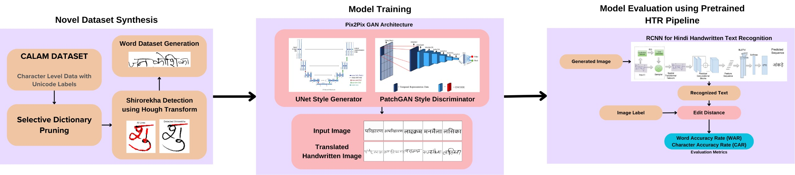
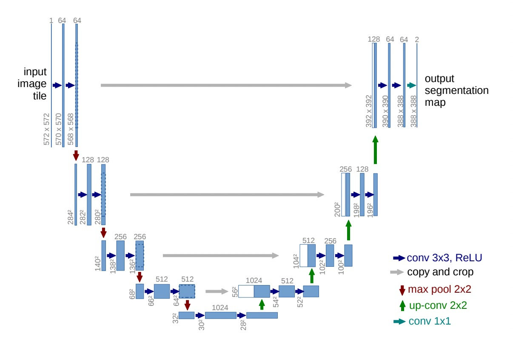
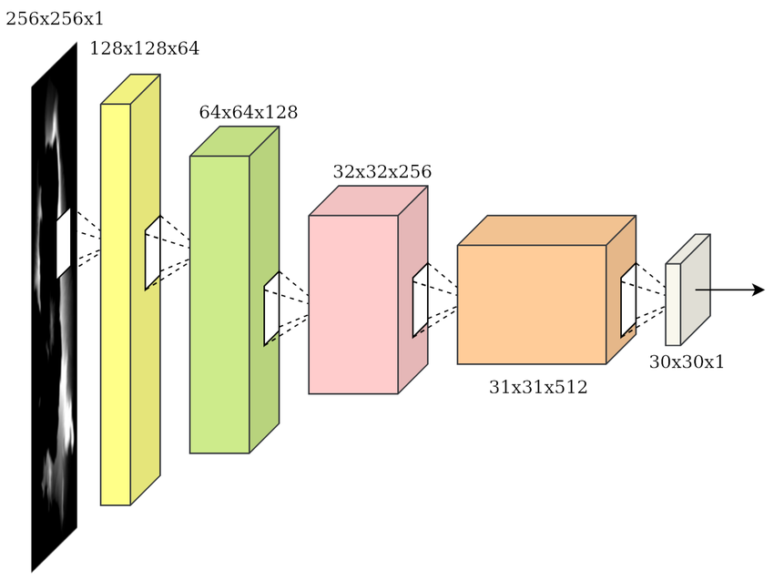
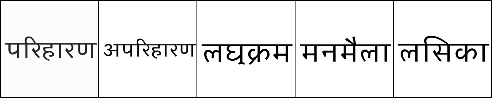
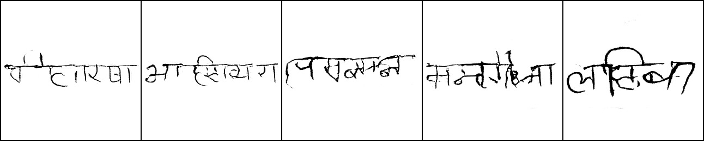
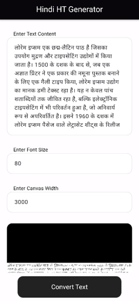
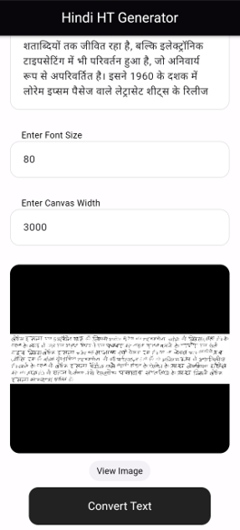
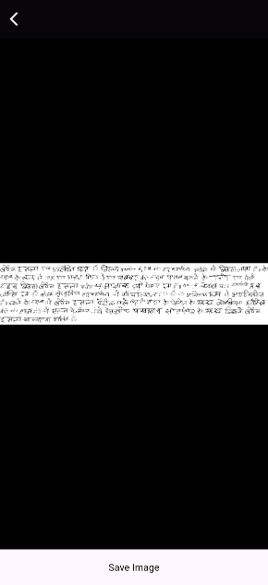

# LekhaGAN: Hindi Handwriting Generation Using Advanced Deep Learning Models

This repository contains the code and methodology for generating realistic handwritten Hindi text using advanced deep learning techniques. The project employs a **Pix2Pix model** for image-to-image translation, focusing on the complexities of Hindi script, such as conjunct characters, diacritical marks, and the shirorekha (horizontal line).

## Table of Contents

-   [Introduction](#introduction)
-   [Features](#features)
-   [Dataset](#dataset)
-   [Model Architecture](#model-architecture)
-   [Evaluation Metrics](#evaluation-metrics)
-   [Results](#results)
-   [Sample Images](#sample-images)
-   [Deployed Application](#deployed-application)

---

## Introduction

Generating handwriting for complex scripts like Hindi is challenging due to intricate character formations and contextual dependencies. This project proposes a novel approach to Hindi handwriting generation by leveraging:

-   Conditional GANs (Pix2Pix architecture).
-   A novel synthetic dataset generated using character-maatra combinations from the CALAM dataset.
-   Evaluation via a Handwritten Text Recognition (HTR) model using **Character Accuracy Rate (CAR)** and **Word Accuracy Rate (WAR)** metrics.

---

## Features

-   Generation of a novel annotated dataset using the original CALAM character dataset.
-   Integration of shirorekha detection for precise character alignment.
-   Generation of realistic Hindi handwritten text from typed text.
-   Evaluation of handwriting quality using advanced HTR models.

---

## Dataset

### CALAM Dataset

-   Hindi words are synthesized using combinations of characters and maatraas.
-   Shirorekha (horizontal line) detection using **Hough Line Transform** ensures proper alignment of Hindi characters.
-   Filtering invalid combinations ensures a high-quality dataset.

---

## Model Architecture

### Pix2Pix with PatchGAN

-   **Generator**: A U-Net-based model transforms typed text into handwriting images.
    
-   **Discriminator**: A PatchGAN evaluates localized patches to enhance quality and detail.
    

### Evaluation Model

-   An HTR model based on CRNN architecture evaluates the legibility of generated text using:
    -   **CTC Loss** for alignment and sequence prediction.
    -   Metrics: **CAR** and **WAR**.

---

## Evaluation Metrics

-   **Character Accuracy Rate (CAR)**: Measures the accuracy of individual character generation.
    -   Formula: \( CAR = 1 - \frac{\text{Edit Distance (Character level)}}{\text{Length of Ground Truth}} \)
-   **Word Accuracy Rate (WAR)**: Evaluates word-level coherence.
    -   Formula: \( WAR = 1 - \frac{\text{Edit Distance (Word level)}}{\text{Length of Ground Truth Words}} \)

---

## Results

-   **CAR**: 23%
-   **WAR**: 0.56%
-   Highlights:
    -   Effective at capturing character nuances.
    -   Challenges remain in generating complex conjuncts and diacritical marks.

---

## Sample Images

**Input Example**:  
  
A synthetically generated Hindi word is used as input to the Pix2Pix model. Each character and maatra is carefully selected according to Hindi grammar rules.

**Output Example**:  
  
The output demonstrates the model’s attempt to capture the subtleties of Hindi script, including ligatures and diacritical marks.

---

## Deployed Application

The Hindi Handwriting Generator application is a mobile app built with **Flutter** to convert typed Hindi text into realistic handwritten-style images. The app communicates with a backend powered by **Quart** and the Pix2Pix model for text-to-handwriting conversion. Below are the details of the application's features and architecture:

### Key Features

1. **Input Customization**:
    - Allows users to input typed Hindi text.
    - Adjustable font size and canvas width for tailored image generation.
2. **Real-time Image Preview**:
    - Displays the generated handwritten image for quick validation.
3. **Save and Share**:
    - Users can save the generated handwritten image to local storage or share it with others.

### Application Screens

#### **First Screen: Input Your Text**

-   **Features**:
    -   Enter Hindi text in a text box.
    -   Adjust font size and canvas width using numeric inputs.
    -   Generate handwritten images by clicking the "Convert Text" button.
-   **Screenshot Placeholder**:  
    

#### **Second Screen: Preview Your Handwriting**

-   **Features**:
    -   Preview the generated handwritten image in a container.
    -   Navigate to the full-screen view using the "View Image" button.
-   **Screenshot Placeholder**:  
    

#### **Third Screen: Full Image and Save Option**

-   **Features**:
    -   View the handwritten image in full screen with pinch-to-zoom functionality.
    -   Save the image to the device's gallery or local storage.
-   **Screenshot Placeholder**:  
    

### Backend Workflow

1. **Text-to-Image Conversion**:
    - Processes each word in the sentence using a Pix2Pix model.
    - Ensures proper alignment of characters and maatraas.
2. **Paragraph Assembly**:
    - Dynamically arranges word images into paragraph format with randomized spacing for natural aesthetics.
3. **API Response**:
    - Returns the final image to the app for display and interaction.

---
